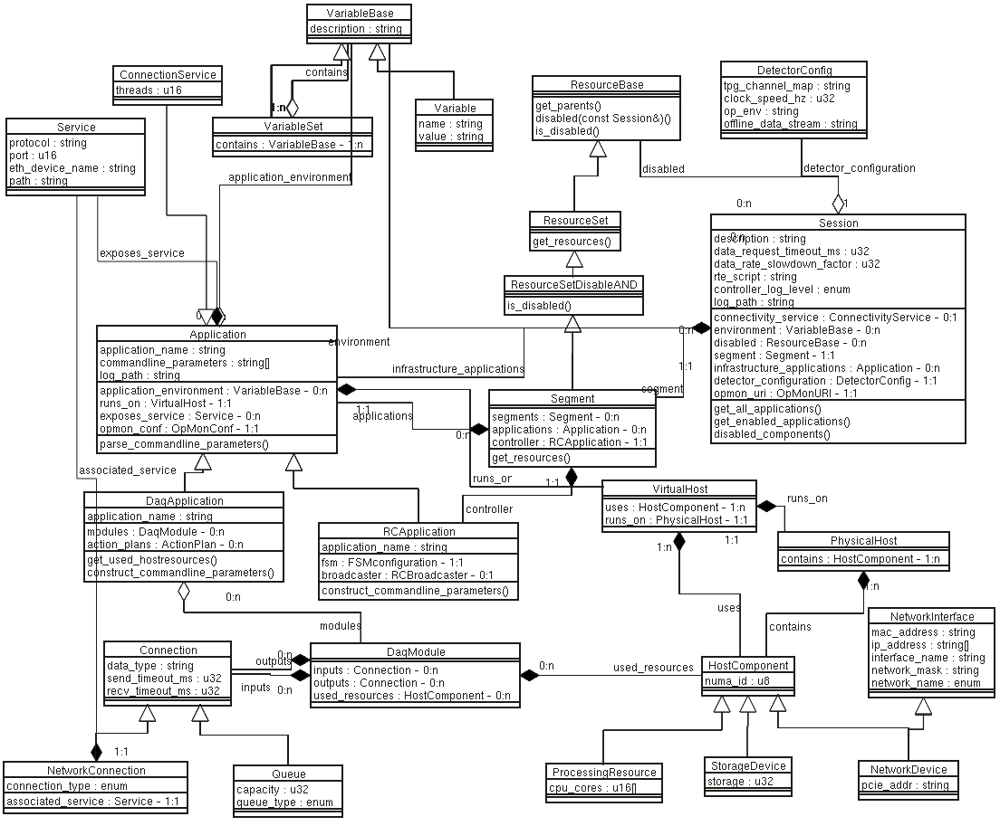
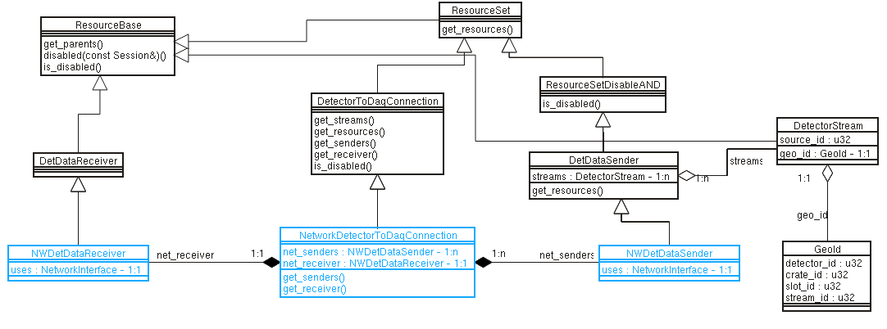

# confmodel
This package contains the 'core' schema for the DUNE daq OKS configuration.

  

The top level of the schema is the **Session** which defines some global
DAQ parameters and has a relationship to a single top-level **Segment**.
It also has a list of disabled Resources. It is intended that parts of
the DAQ system that are not required in the current run are simply
disabled rather than deleted from the database altogether.

A **Segment** is a logical grouping of applications which
are controlled by a single controller. A **Segment** may contain other
nested **Segment**s. A **Segment** is a Resource that can be enabled/disabled,
disabling a **Segment** disables all of its nested **Segment**s.

The **Application** class has attibutes defining the application's
 `application_name` (executable name) and `commandline_parameters`. Its
 `application_environment` relationship lists environment variables needed by the
 application in addition to those defined by the **Session**. An
 [example Python script](https://github.com/DUNE-DAQ/confmodel/blob/develop/scripts/app_environment.py)
 that prints out the environment for enabled applications in the
 **Session** is provided in the `scripts` directory.

## Resources and ResourceSets

**ResourceBase** is an abstract class describing an item that can be
disabled directly. It has the method `disabled()` which can be called
by application code to determine if the object should be considered
disabled for this session. The disablng logic calls the virtual
`is_disabled()` method to determine the state of the Resource. The
implementation provided by the base class just checks that the object
itself is not in the list of disabled objects. Derived classes can
reimplement this method with whatever logic is needed to determine the
state of the object, for example the **ResourceSetDisableAND** class
provides an implementation that ANDs together the state of all of its
contained objects.

A **ResourceSet** is an abstract container of **Resource**s (actually items
inheriting from **ResourceBase**) which can be disabled together. It
is itself a Resource (so can be nested). It defines a pure virtual method `get_resources()` to get the list of contained resources. Developers should implement this method to extract any resources that need to be considered for determining the disabled state of the set from among the class's relationships.

A **ResourceSetDisableAND** is a container of **Resource**s which will
be disabled if *all* of its **Resource**s are disabled. It provides a
final implementation of the ResourceSet::is_disabled() method.

A **ResourceSetDisableOR** is a container of **Resource**s which
provides a final implementation of the ResourceSet::is_disabled()
method returning true if *any* of its contained **Resource**s are
disabled.

A **Segment** is a container of **Segment**s and **Applications**
which inherits from **ResourceSetDisableAND** so it can be disabled
directly or indirectly if all its components are disabled.
 

## The Resource disabled logic

The Resource disabled logic works on a single tree of **ResourceSets**
and is currently tied to the **Session**
object. The constructor of the **Session** object constructs a
**DisabledResources** object passing a reference to itself.
**Any ResourceSet that is not referenced by a ResourceSet in the tree
starting at the Session's segment relationship will not be considered
by the disabling logic!**

The **DisabledResources** constructor will configure itself using the
tree of Resources starting with the Session's `segment` relationship
and the list of disabled resources from its `disabled` relationship.
To start with, the UID of each member of the list is inserted into a
set and any 'contained' (using the `get_resources()` method) Resources
are also disabled.

A list of all ResourceSets in the tree starting from the Segment is
generated by recursively iterating over all the Resources in the
Segment and calling `get_resources()`.  Then it iterates over the list
of **ResourceSet**s. If a ResourceSet is not currently in the disabled
set, it will call the `is_disabled()` method to see if its state has
been changed by the current content of the disabled set. It will
repeat this procedure until an iteration that ends with the same
number of disabled resources it started with.

## Readout Map

 

(the blue classes in the diagram are not part of confmodel and are
there to show how the other parts fit together)

The detector to DAQ connections are described using different types of **Resources**.
The **DetectorToDaqConnection** is a **ResourceSet** with a custom implementation of `is_disabled()` that checks that the **DetDataReceiver** and at least one **DetDataSender** are enabled.

Each **DetDataSender** contains a set of **DetectorStream**s, which consist of a **Resource** associated to one **GeoId**.

## Finite State Machines
Each controller (**RCApplication**) uses one **FSMConfiguration** object that describes action, trasnisions and sequences.

 

## Notes

### VirtualHost

 The idea is that this decribes the subset of resources of a physical
host server that are available to an Application. For example two
applications may be assigned to the same physical server but each be
allocated resources of a different NUMA node.

### **DaqApplication** and **DaqModule**

 The **DaqApplication** contains a list of **DaqModule**s each of which has a
list of used resources. The **DaqApplication** provides a method
`get_used_hostresources` which can be called by `appfwk` in order to check
that these resources are indeed associated with the VirtualHost by
comparing with those listed in its `hw_resources` relationship.

### NetworkConnection
  Describes the connection type and points to the **Service** running over this connection.
